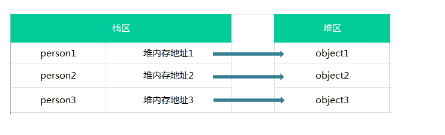

::: tip
  值类型（基本类型）：Number、String、Boolean、undefined、null、Symbol（唯一） <br>
  引用数据类型（对象类型）：Object（object、array、function）、BigInt（内置对象，表示任意大的整数）
:::

## 一、判断类型
### 1、typeof
- 1、如果变量a没有声明，则`typeof a // ‘undefined’`
- 2、对象返回`object`，例如：`{ } , [ ]`
- 3、null返回object，`typeof null // ‘object’`
### 2、instanceof
- 1、验证一个对象是否为指定的构造函数的实例，<br>
例如：`obj instanceof Object // true`，`obj instanceof Number // false`
### 3、Object.prototype.toString
- 1、返回对象的类型字符串，可以用来判读一个值的类型
- 2、实例对象可能会自定义toString方法，覆盖掉Object.prototype.toString方法，所以为了得到类型字符串，最好直接使用Object.prototype.toString方法<br>
通过函数的call方法，可以在任意值上调用这个方法来判断类型：Object.prototype.toString.call(value) -> 表示对value这个之调用Object.prototype.toString方法
- 3、不同数据类型的Object.prototype.toString方法返回值：<br>
**·** 数值：[object Number]<br>
**·** 字符串：[object String]<br>
**·** 布尔值：[object Boolean]<br>
**·** undefined：object Undefined]<br>
**·** null：[object Null]<br>
**·** 数组：[object Array]<br>
**·** 函数：[object Function]<br>
**·** arguments：[object Arguments]<br>
**·** Error对象：[object Error]<br>
**·** Date对象：[object Date]<br>
**·** RegExp对象：[object RegExp]<br>
**·** 其他对象：[object object]<br>

## 二、基本数据类型
### 1、存储位置
- **栈**存储<br>
占据空间小，大小固定，属于被频繁使用的数据<br>
不能给基本类型添加属性和方法，否则打印会获得undefined
### 2、传值方式
- 按值传递（不可变性质）<br>
函数的形参是被调用时所传参数的副本，修改形参的值并不会影响实参<br>
传递数据时每次都需要克隆副本，对于复杂类型效率较低<br>

## 三、引用数据类型
### 1、存储位置
- **堆**存储<br>
占据空间大，大小不固定，引用数据类型在栈内存储了指针，指针指向堆中该实体数据的起始地址，当解释器寻找引用值时，会先检索在栈中的地址，取得地址后，再从堆中获得实体数据<br>
引用类型的存储需要内存的栈区和堆区（堆区是指内存里的堆内存）共同完成，栈区内保存变量标识符和指向堆内存中指向该对象的指针（该对象在堆内存的地址）<br>
假如有如下几个对象：
```
var person1={ name: "xiaoming" }
var person2={ name: "xiaohong" }
var person3={ name: "xiaoxiao" }
```

### 2、传值方式
- 按引用传递（可变性质）<br>
函数的形参接收实参的隐式引用，不再是副本，则修改形参的值实参也会被修改，两者指向相同的值<br>
传递数据时会使参数的追踪变得困难，有时会引起一些bug