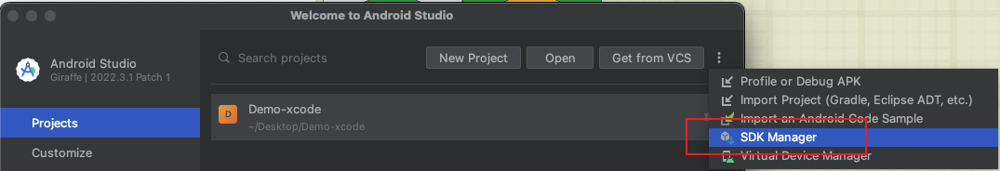
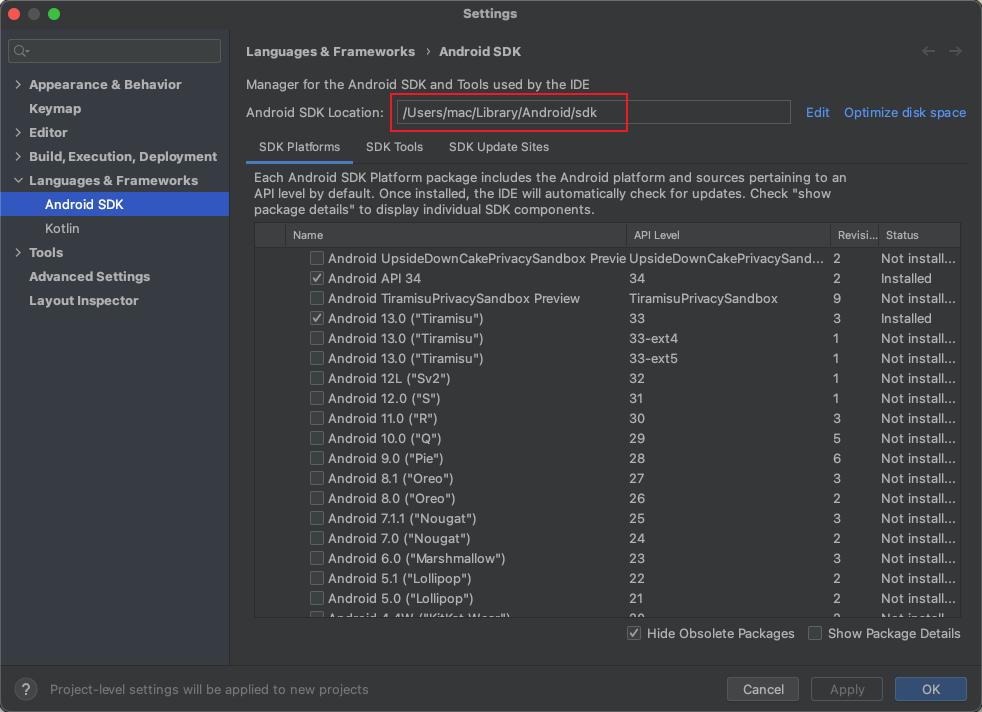
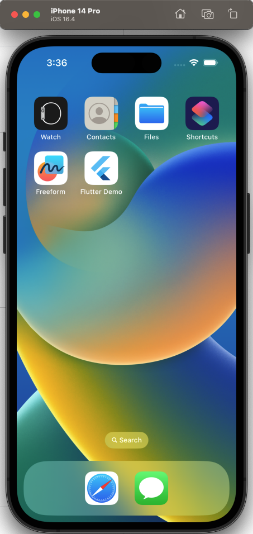
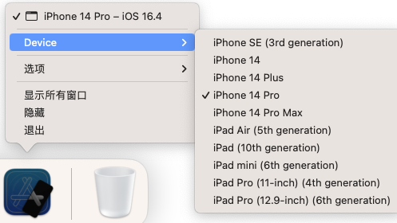

::: tip
此篇为Mac下搭建环境，依照官网依次进行，仅记录部分 <br>
[此处为Flutter中文官网](https://flutter.cn/docs/get-started/install/macos?tab=ios16)
:::

## 一、配置 flutter 的 PATH 环境变量
- 只会在当前命令行窗口生效
```
export PATH="$PATH:`pwd`/flutter/bin"
```
- 永久有效-> [更新 PATH 环境变量](https://flutter.cn/docs/get-started/install/macos?tab=ios16#update-your-path)
   - `open -e .zshrc` 打开对应rc文件，我这里使用的是Z Shell，所以需要修改 $HOME/.zshrc 文件
   - 在打开的文件中添加 
    ```
    export PATH="$PATH:[PATH_OF_FLUTTER_GIT_DOCUMENTS]/bin
    ```
   - `PATH_OF_FLUTTER_GIT_DOCUMENTS` 是自己flutter文件夹放置的位置
   - 在终端运行以下几步，最后测试命令是否可用
   ```
   source $HOME/.bash_profile  // 刷新当前命令行窗口
   echo $PATH  // 验证 flutter/bin 文件夹是否已经添加到PATH环境变量中
   which flutter  // 验证命令是否可用
   ```

## 二、运行 flutter doctor 命令
- 运行`flutter doctor`，查看当前环境是否需要安装其他的依赖（末尾增加 `-v` 输出会更加详细）
- 刚开始可以会出现多个警告或报错，大概率是因为其他依赖没有安装，只需要按照文档依次安装即可
- 完成一部分即可执行`flutter doctor`查看一下，直到没有警告或报错
- 最后出现 `No issues found!` 则表示成功

### 1、Android toolchain
<b>1——若是出现类似下方提示，可先按以下部分操作</b>
```
[!] Android toolchain - develop for Android devices
    • Android SDK at /Users/dash/Library/Android/sdk
    ✗ Android SDK is missing command line tools; download from https://goo.gl/XxQghQ
    • Try re-installing or updating your Android SDK,
      visit https://flutter.cn/docs/setup/#android-setup for detailed instructions.
```
  - [设置Android开发环境](https://flutter.cn/docs/get-started/install/macos?tab=ios16#install-android-studio)
  - 1. 进入 Android Studio，查找到 SDK地址 并复制记录下来
     - 
     - 
  - 2. 到终端输入命令：`flutter config --android-sdk <directory>` ，`<directory>`的位置填写你复制的SDK地址

<b>2——出现类似`! Some Android licenses not accepted.xxxxx`报错</b>
```
[!] Android toolchain - develop for Android devices
    ! Some Android licenses not accepted.xxxxx
```
  - [同意 Android 协议](https://flutter.cn/docs/get-started/install/macos?tab=ios16#agree-to-android-licenses)
   - 1. 终端执行 `flutter doctor --android-licenses`
   - 2. 终端会出现好几个 y/N 的提问，一律选 y 即可
   - 3. 最后出现 `All SDK package licenses accepted` 则证明全部接收完毕
   - 4. 若提示还有未接收的，则再次执行 `flutter doctor --android-licenses` 接收一次

### 2、cocoapods
- 如果`cocoapods`报错，可运行此命令进行install
```
sudo gem install cocoapods
```
- 如果在Apple芯片的Mac上安装，则需要运行
```
sudo gem uninstall ffi && sudo gem install ffi -- --enable-libffi-alloc
```

### 3、timeout
- 如果想延长超时时间，可在命令行执行以下命令，默认为10s，可修改为大于10的整数
```
flutter run --device-timeout 60
```

## 三、设置iOS开发环境
[设置iOS具体步骤](https://flutter.cn/docs/get-started/install/macos?tab=ios16#ios-setup)
### 1、安装Xcode
- 如果安装完成后无法打开，可尝试重启电脑
- 依次在命令行运行以下命令
  ```
  sudo xcode-select -s /Applications/Xcode.app/Contents/Developer
  sudo xcodebuild -runFirstLaunch
  sudo xcodebuild --license  // 同意Xcode的许可协议
  ```

### 2、配置iOS模拟器
- 执行 `open -a Simulator`，会出现类似如下的手机页面
- 
- 操作列会出现如下图标，可选择你想要的手机模式
- 