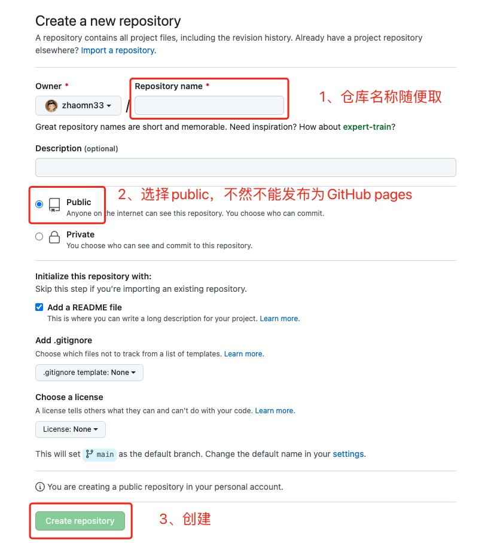
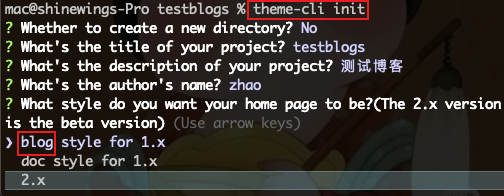
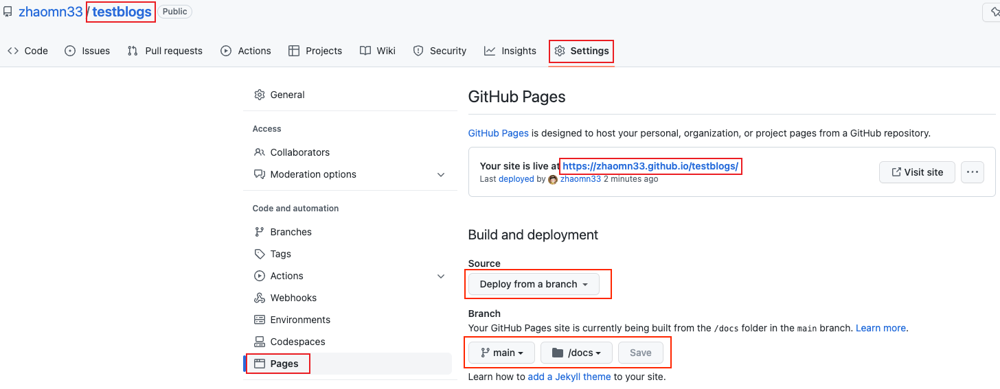
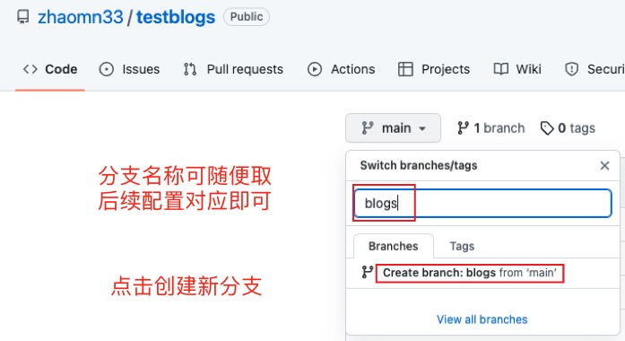
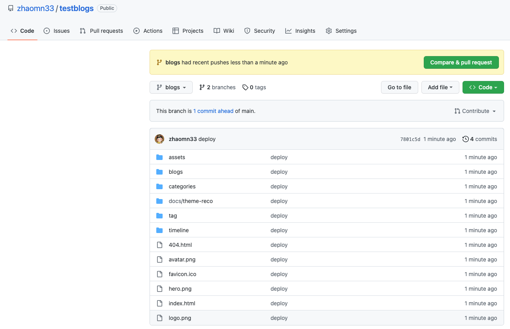
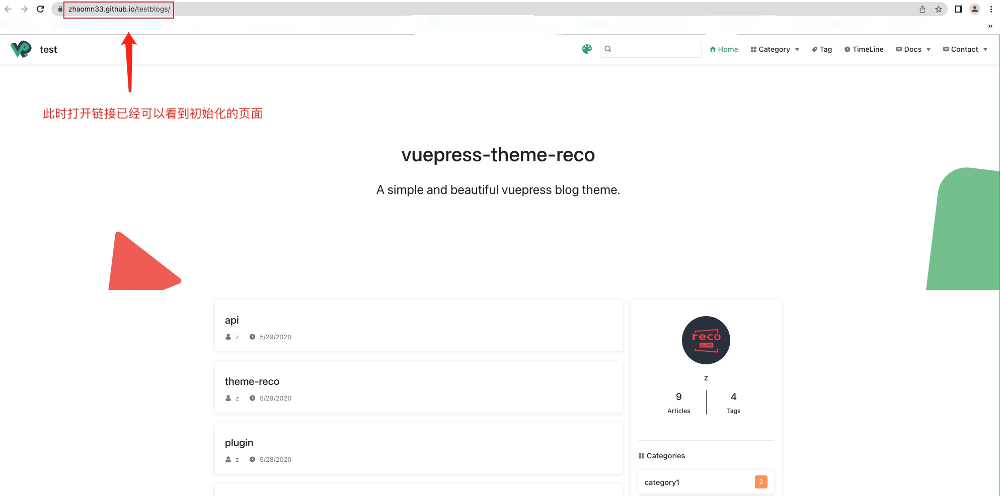

::: tip  描述
GitHub内搭建个人博客的详细步骤
:::

## 一、新建一个GitHub仓库
- 点击New repository
<!-- 图片添加： ! + [图片描述 ] + (图片的url 【可以是网络地址、本地地址】) -->


## 二、克隆项目并初始化
- 1、在cmd中，`git clone <刚才的项目地址>`
- 2、推荐使用yarn搭建项目 `yarn init`
- 3、执行 `yarn global add @vuepress-reco/theme-cli` 安装全局主题脚手架
- 4、执行 `theme-cli init` （本文最后一步选择了blog主题）

- 5、修改 package.json
```
 "scripts": {
    "dev": "vuepress dev .",
    "build": "vuepress build ."
  }
```
- 6、执行 `yarn dev` 等待编译完成，即可看见页面
## 三、向GitHub推送项目并部署
### 推送
- 1、.vuepress/config.js （相应配置可自行查询vuepress官网修改）
<!-- 链接添加： [描述 ] + (url) -->
[https://vuepress.vuejs.org/config/#overview](https://vuepress.vuejs.org/config/#overview)
```
module.exports = {
  "dest": "dist", // dest 放置后续build的内容，可自行修改，后面对应上即可
  "base": "/testblogs/", // <testblogs> 必须是当前GitHub仓库名称，且前后都有‘/‘
}
```
- 2、将此时的项目推送到仓库内 git push<br>
对应 Source 和 Branch (main) 选择好，点击save<br>
刷新可看到已自动发布

此时点击blog链接，页面为404，原因是缺少对应的index.html文件<br>
GitHub pages 必须要有index.html，由于vuepress是Markdown语法，没有html，所以显示不了
### 部署
- 1、创建新分支<br>

- 2、执行 yarn build 打包dist文件
- 3、此时可手动删除新分支上的所有内容<br>
并将生成的 **dist文件夹内** 的所有内容复制到新建的分支上
此时新分支状态：

- 4、将 Settings -> Pages -> Branch 下的分支改为 blogs 下，不断save刷新，可能有缓存，此时应该已经部署好了
