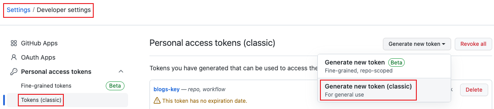
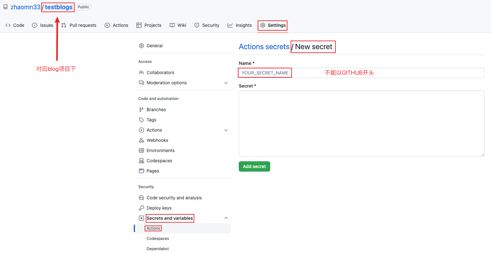

::: tip 描述
blog搭建完成后，下一步则实现自动部署，无须再手动拖动文件
:::

## 一、配置yml文件
- 在mian分支下，在根目录新建 .github/workflows 文件夹，新建一个deploy.yml文件，文件名可任取<br>
此为文件内容：
```yml
name: Github Action

on:
  push:
   branches:
    - main

jobs: # 任务
  build: # 自定义名称
    runs-on: ubuntu-latest

    strategy:
      matrix:
        node-version: [14.x]

    steps:  # 指定每个job的运行步骤。可以包含一个或多个步骤
      - name: Checkout  # 步骤1
        uses: actions/checkout@v1 # 作用：获取源码。 官方actions库：https://github.com/actions

      - name: Use Node.js ${{ matrix.node-version }} # 步骤2
        uses: actions/setup-node@v1 # 作用：安装nodejs
        with:
          node-version: ${{ matrix.node-version }} # 版本

      - name: Build and Deploy # 步骤3
        # 构建和部署
        run: |  # %ae 作者的电子邮件地址 【git log --pretty=format:  格式化log输出】
          echo '获取仓库基本信息'
          remote_addr=`git remote get-url --push origin`
          commit_info=`git describe --all --always --long`
          user_name='zhaomn33'
          user_email=`git log -1 --pretty=format:'%ae'`   
          deploy_branch=blogs

          echo ${remote_addr}
          echo ${commit_info}
          echo ${deploy_branch}

          yarn
          yarn build # 是 package.json 内 script 运行打包
          cd dist # 进入打包好的文件内
          git config --global init.defaultBranch $deploy_branch
          git init
          echo ${user_name}
          echo ${user_email}

          git config user.name ${user_name}
          git config user.email ${user_email}
          echo '设置git用户信息完成'

          git add -A
          git commit -m "auto deploy, $commit_info"
          remote_addr=`echo $remote_addr | awk -F'://' '{print $2}'`
          remote_addr=https://${user_name}:${{secrets.TEST_BLOG_SECRET}}@${remote_addr}
          echo ${remote_addr}
          git remote add origin ${remote_addr}
          git push origin HEAD:$deploy_branch --force # 推送到github $deploy_branch分支
```
## 二、创建token
- 1、在GitHub主页面，进入 Settings -> Developer settings -> Personal access tokens，新建一个token<br>

- 2、填写名称，选择对应配置

- 3、创建好的tokens及时复制保留（退出后无法再次查看，只能重新创建新的），后面用于创建secret<br>

- 4、进入对应blog项目下，点击 New repository secret 按钮创建secret，将刚才复制的tokens填入，点击ADD后，会自动跳转<br>
此时 Repository secrets 下已经有了刚刚创建的secret<br>
之后可以在yml文件内直接使用 secrets.TEST_BLOG_SECRET（secrets.secret名称）

- 5、此时重新推送代码，可实现自动部署。