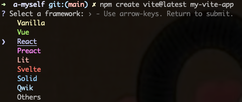
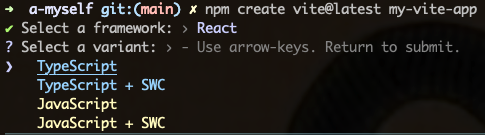
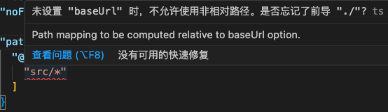

::: tip
vite需要Node版本>=12.0.0，如果你的包管理器发出警告，请注意升级你的Node版本
:::

## 搭建

```
npm create vite@latest my-vite-app
```


```
cd my-vite-app
npm install
npm run dev
```

### 设置src别名
- 修改vite.config.ts
```
export default defineConfig({
  plugins: [react()],
  resolve: {
    alias: {
      '@': '/src'
    }
  }
})
```
- 修改tsconfig.json
```
"compilerOptions": {
  "baseUrl": "./",
  "paths": {
    "@/*": [
      "src/*"
    ]
  }
}
```


### Router搭建
- 使用 `react-router-dom` [👉戳这里](https://reactrouter.com/en/main/routers/create-browser-router)
   - 安装 react-router-dom `npm install react-router-dom`
- 入口文件
  [👉戳这里](https://reactrouter.com/en/main/routers/router-provider)
```
// App.tsx

import './App.css'
import { RouterProvider } from 'react-router-dom'
import Routes from '@/router/routes'
// 👉 在src下可以新建router文件夹，用于放置路由，也可以直接写在此文件内

function App() {
  // 👉 RouterProvider：所有的路由对象都需要此组件来渲染应用
  return <RouterProvider router={ Routes } />
}
```
- App挂载
```
// main.tsx - 自动生成

import React from 'react'
import ReactDOM from 'react-dom/client'
import App from './App.tsx'
import './index.css'

ReactDOM.createRoot(document.getElementById('root')!).render(
  <React.StrictMode>
    <App />
  </React.StrictMode>
)
```
- 路由
   - createBrowserRouter：v6的api，在react项目中建议使用router，他底层是用 DOM History API 对URL的更新管理，存储在对应的 history 栈
   - 路由API ： 
     - BrowseRouter ：用于浏览器路由模式（历史记录模式）
     - HashRouter ：用于切换路由模式（哈希模式）
   - route：将`url`和`组件`连接起来
     - 在v6中使用Route，外层必须加上Routes组件，即Routes->Route
```
import { createBrowserRouter } from "react-router-dom"

const Routes = createBrowserRouter([
  {
    path: "/",
    element: <Root />,
    errorElement: <ErrorPage />,
    loader: rootLoader,
    action: rootAction,
    children: [
      {
        // 👉 根据冒泡就近原则，再嵌套一层子路由，将errorElement属性统一放在根子路由上，此时错误页面会在根出口中呈现
        errorElement: <ErrorPage />,
        children: [
          { index: true, element: <Index /> },
          {
            path: "contacts/:contactId",
            element: <Contact />,
            loader: contactLoader,
            action: contactAction
          },
          {
            path: "contacts/:contactId/destroy",
            action: destroyAction,
            errorElement: <div>Oops! There was an error.</div>
          }
        ]
      }
    ]
  }
])
```
- path：路由地址
- element：当前路径的页面
- errorElement：错误页面（冒泡就近原则）
   - 如果在子路由:
     - 未添加 errorElement 属性时，他会找到根路由的 errorElement
     - 添加有 errorElement 属性时，他会找到自己的 errorElement
- loader：每个路由都可以定义一个‘loader’函数，在渲染之前为route元素提供数据
- action：方法，仅在使用数据路由器（如createBrowserRouter）时有效
- children：子路由